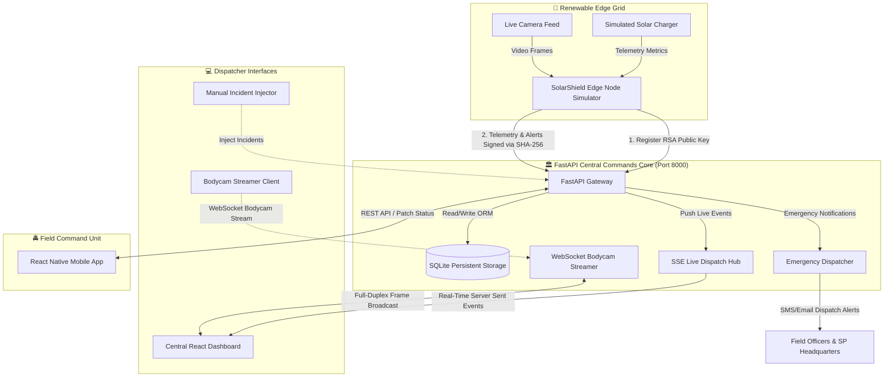

# 🛡️ SolarShield AI: Autonomous Smart Policing Network (AEGIS Nexus)

[](https://www.python.org/)
[](https://fastapi.tiangolo.com/)
[](https://sqlite.org/)
[](https://react.dev/)
[](https://reactnative.dev/)
[](LICENSE)

**SolarShield AI (AEGIS Nexus)** is a next-generation, decentralized smart policing and autonomous surveillance platform. It bridges the gap between clean solar energy, edge AI hardware, and centralized law enforcement dispatch commands. 

The system simulates a network of solar-powered edge AI camera poles deployed across a metropolitan grid (defaulted to Ahmedabad coordinates). These nodes perform on-device computer vision tasks (weapon detection, face matching, violence tracking, and license plate reading) while continuously managing their renewable energy budgets and verifying their operations using public-key cryptography.

---

## 🏗️ System Architecture

The platform is designed around a decoupled, real-time microservices architecture:



---

## 🗂️ Project Directory Structure

```text
AgisNexus/
├── ai-edge-node/
│   └── main.py              # Solar-charging simulator & RSA-signed alert/telemetry client
├── backend/
│   ├── app/
│   │   ├── core/
│   │   │   ├── config.py    # Global configurations & default emergency alert recipients
│   │   │   ├── database.py  # SQLite connection manager (SQLAlchemy)
│   │   │   └── security.py  # Cryptographic verification logic (RSA SHA-256)
│   │   ├── schemas/
│   │   │   └── schemas.py   # Pydantic data schemas
│   │   ├── main.py          # FastAPI application server, SSE feed, and bodycam WebSocket
│   │   └── models.py        # SQLite database tables (ORM Models)
│   └── requirements.txt     # Python dependencies
├── frontend/
│   └── index.html           # Standalone high-performance React + Tailwind dashboard client
├── mobile-app/
│   └── App.js               # React Native (Expo) field officer dispatch feed application
├── static/                  # Static assets served by the central backend server
│   ├── index.html           # Mounted Central Command GIS & AI Dashboard
│   ├── mobile.html          # Web-based bodycam streamer (feeds dashboard over WebSocket)
│   ├── simulator.html       # Web panel for manual telemetry and alert triggers
│   ├── face-api.min.js      # Client-side face detection engine
│   ├── object-detector.js   # Client-side object detection helpers
│   ├── models/              # Pre-trained models for face landmarks, expression, and recognition
│   └── assets/              # Simulated visual assets and evidence clips
├── index.html               # Root client-side face recognition & enrollment page
├── script.js                # Root page biometric logic & canvas bounding boxes
├── styles.css               # Root page custom cyberpunk stylesheet
├── run_demo.py              # Suite orchestrator (starts FastAPI + Edge simulator in parallel)
├── run.bat                  # Single-click launcher for Windows systems
└── solarshield.db           # SQLite database file (created on startup)
```

---

## 🌟 Key Features & Subsystems

### 1. Central FastAPI Command Core (`backend/`)
* **Persistent Storage**: Utilizes SQLAlchemy with `aiosqlite` to store registered edge nodes, telemetry logs, triggered alerts, face biometric descriptors, and dispatch logs.
* **Server-Sent Events (SSE)**: Exposes a `/alerts/feed` endpoint that streams live threat detections to the front-end dashboard instantly.
* **Cryptographic Gateway**: Verifies every incoming payload signature from edge nodes using their registered RSA public keys, rejecting tampered telemetry.
* **Emergency Dispatch**: Automatically triggers SMS/Email warnings for `CRITICAL` threat levels and registers them in the dispatch table.

### 2. Autonomous Edge Node Simulator (`ai-edge-node/`)
* **Cryptographic Identity**: Generates a 2048-bit RSA key pair on startup and registers its public key with the backend server.
* **Simulated Battery & Solar Dynamics**: Simulates battery state-of-charge (SoC), panel voltage, draw current, system temperatures, and CPU/GPU usage.
* **Adaptive Power-Aware Operations**: 
  * **Normal (>50% Battery)**: Processes AI inferences and uploads telemetry every 5 seconds.
  * **Throttled (15% - 50% Battery)**: Slows sampling rate to 8 seconds to prevent rapid depletion.
  * **Low Power (<15% Battery)**: Shuts down vision model simulation, enters sleep mode, and reports minimal telemetry every 15 seconds.

### 3. Biometric Enrollment & Sync
* Includes browser-based client-side face recognition via `face-api.min.js`.
* Allows administrators to enroll new suspects using their live webcam or uploading photos.
* Extracts 128-dimensional facial descriptors (embeddings) and saves them in the database, enabling nodes to match real-time feeds.

### 4. WebSocket Live Bodycam Streaming (`static/mobile.html`)
* Demonstrates live stream forwarding. 
* By opening `mobile.html` on a webcam-enabled device, it captures camera frames and sends them over a WebSocket connection to `ws://localhost:8000/api/v1/bodycam/stream`.
* The dashboard receives the stream in real-time, displaying a live bodycam broadcast.

### 5. Field Officer Command App (`mobile-app/`)
* Built with React Native & Expo for law enforcement personnel.
* Displays a live feed of dispatch orders in real-time.
* Allows field officers to acknowledge alerts, review GPS locations, and mark events as `RESOLVED`.

---

## ⚡ Getting Started

### Prerequisites
* **Python 3.10+** (ensure python is added to your environment `PATH`)
* **Node.js** (optional, only required if deploying the React Native app)
* A modern web browser with camera permissions allowed.

### Installation

1. Navigate to the project root directory:
   ```bash
   cd AgisNexus
   ```

2. Install python dependencies for the backend server:
   ```bash
   pip install -r backend/requirements.txt
   ```

3. Install requirements for the edge node simulator:
   ```bash
   pip install requests cryptography
   ```

---

## 🚀 Running the Demonstration Suite

You can start both the Central Backend and the Edge Node Simulator simultaneously using the provided automated script.

#### On Windows:
Double-click `run.bat` or run:
```cmd
run.bat
```

#### On macOS / Linux:
Run the orchestrator Python script directly:
```bash
python run_demo.py
```

### Accessing the Interfaces

Once the suite launches, the following services are available:

1. **Central Dashboard UI**: Open `http://localhost:8000` or double-click [static/index.html](file:///c:/Users/mannt/OneDrive/Desktop/AgisNexus/static/index.html) in your browser.
2. **API Interactive Documentation**: Access Swagger UI at `http://localhost:8000/docs`.
3. **Webcam Bodycam Streamer**: Open [static/mobile.html](file:///c:/Users/mannt/OneDrive/Desktop/AgisNexus/static/mobile.html) in a separate tab or device, allow camera access, and click **Start Streaming** to broadcast live frames to the dashboard.
4. **Manual Threat Simulator**: Open [static/simulator.html](file:///c:/Users/mannt/OneDrive/Desktop/AgisNexus/static/simulator.html) to manually inject custom incidents (e.g. Weapon Detection, Violence, GEOFENCE breach) directly into the database.
5. **Client-side Biometrics Demo**: Double-click the root [index.html](file:///c:/Users/mannt/OneDrive/Desktop/AgisNexus/index.html) to run a standalone, local face recognition and PDF log exporter tool.

---

## 🔒 Security & Verification Protocol

To prevent spoofing or database injection by rogue physical devices, the backend strictly verifies the integrity of incoming data:

1. **Identity Phase**: The Edge Node generates a unique RSA private key, exposing only the public key during registration.
2. **Telemetry Signature**: Every telemetry payload signs the message pattern `node_id:timestamp:battery_soc` with the private key.
3. **Alert Signature**: Every incident alert signs the message pattern `node_id:alert_type:threat_level`.
4. **Backend Audit**: The backend hashes and verifies the incoming signature against the node's stored public key using `cryptography.hazmat.primitives.asymmetric.padding.PKCS1v15`. Any signature failure prints security warnings on the server logs.

---

## 🛠️ Technology Stack Details
* **Backend**: FastAPI, SQLAlchemy (ORM), Aiosqlite, Pydantic, Uvicorn, WebSockets.
* **Frontend**: React (loaded dynamically), Tailwind CSS, Lucide Icons, Face-API.js, JS-PDF.
* **Mobile-App**: React Native, Expo.
* **Edge Node**: Python 3, RSA/SHA-256 Cryptography (PyCA Cryptography), Requests.
* **Database**: SQLite (SQLAlchemy core).

---
*Developed under the AEGIS smart policing initiative.*
